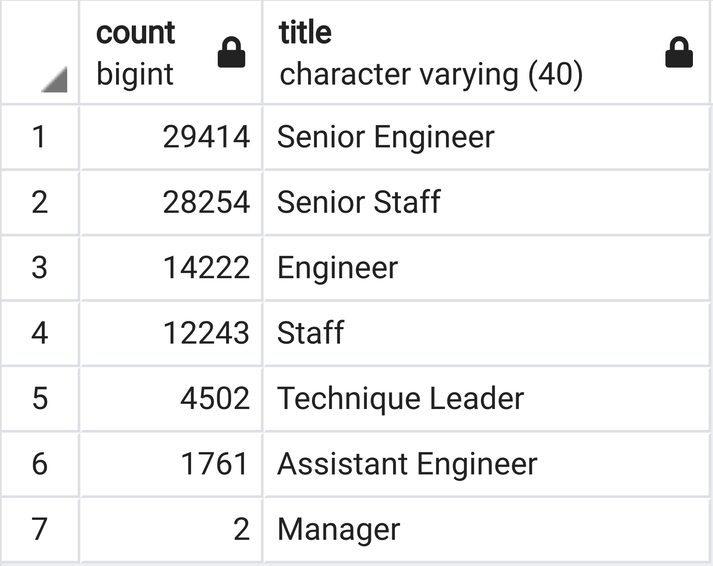
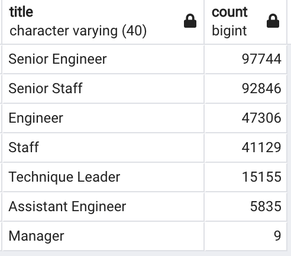
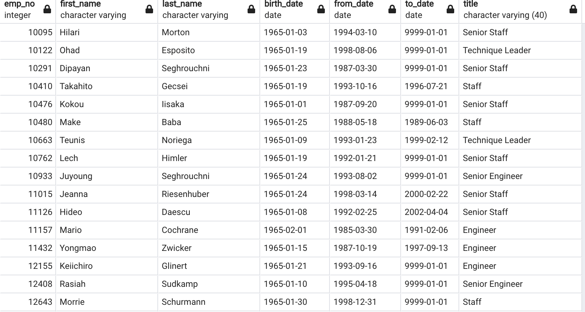

# Overview
This project is to determine the number of retiring employees per title, and identify employees who are eligible to participate in a mentorship program

# Results

* There are 29414 senior engineers will retire, it is about 30 percentage of 97744 of total senior engineers.
* There are 28254 senior staff will retire, it is about 30 percentage 92846 of total senior staff.
* A large number of senior engineers and senior staff retired, which may lead to reduced work efficiency

* There are only 1940 employees are eligible mentor

# summary
* Almost every role will need to be filled as the "silver tsunami" begins to make an impact, because there are about 30 percentage employees will retire from each role.

* There might are not enough qualified, retirement-ready employees in the departments to mentor the next generation.